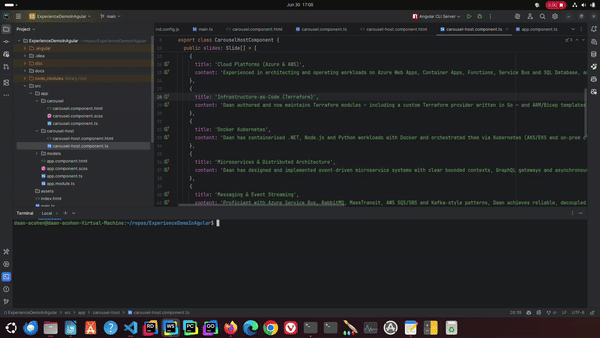

# Angular Carousel Demo



This project demonstrates a reusable text-only carousel component in Angular with a clear separation between data (model) and presentation (view and logic).

## Automated Setup and Running Instructions

Follow these steps to set up and run the application without any human interaction required.

### Prerequisites

- Node.js (v14.x or higher)
- npm (v6.x or higher)

You can check your versions with:
```bash
node -v
npm -v
```

### Installation

1. Clone the repository:
```bash
git clone <repository-url>
cd cvdemo2
```

2. Install dependencies (this may take a few minutes):
```bash
npm run setup
```

This command:
- Installs all dependencies with minimal output
- Prevents npm from showing funding messages, audit reports, and progress information
- Automatically disables Angular analytics to prevent interactive prompts

### Building the Application

Build the application with:
```bash
npm run build
```

This command builds the application in production mode with minimal output.

### Running the Application

Start the development server with:
```bash
npm start
```

This command:
- Starts the development server
- Opens the application in your default browser
- Suppresses progress information

To make the application accessible from other devices on your network:
```bash
npm run start:network
```

The application will be available at `http://localhost:4200/`.

### Testing the Carousel

Once the application is running, you can test the carousel functionality:

1. **Auto-advancing**: The carousel will automatically advance to the next slide every 6 seconds.

2. **Manual navigation**:
   - Click the left arrow (`‹`) to go to the previous slide
   - Click the right arrow (`›`) to go to the next slide
   - Click any of the dots at the bottom to jump to a specific slide

3. **Pause/Resume**:
   - Hover over the carousel to pause the auto-advancing
   - Move the mouse away from the carousel to resume auto-advancing

## Project Structure

The project follows a clean separation of concerns:

- **Data Model** (`src/app/models/slide.model.ts`): Defines the structure of a slide.
- **Presentation Component** (`src/app/carousel/`): Handles rendering and carousel functionality.
- **Host Component** (`src/app/carousel-host/`): Provides the data to the carousel.

## Verification Script

A verification script is included to ensure the application can be built without any human interaction:

```bash
npm run verify
```

Or you can run the script directly:

```bash
./verify-build.sh
```

This script:
- Installs dependencies using the setup script
- Builds the application
- Provides feedback on the success of the verification

## Troubleshooting

If you encounter any issues:

1. **Port conflicts**: If port 4200 is already in use, you can specify a different port:
```bash
npm start -- --port=4201
```

2. **Build errors**: Clear the cache and node_modules, then reinstall:
```bash
rm -rf node_modules
rm -rf .angular/cache
npm run setup
```

3. **Browser cache issues**: Try opening the application in an incognito/private window.
